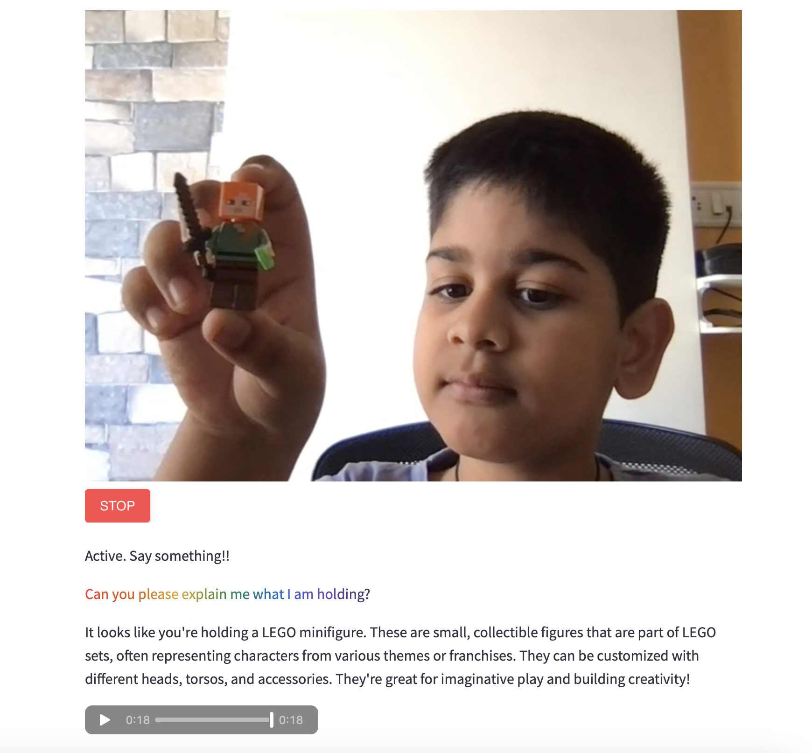

# Curious Samm

Introducing **Curious Samm**, the revolutionary app that answers questions about any object displayed in live video streams in near real-time. Powered by **Streamlit**, **LangChain**, and **Gen AI**, this app provides an immersive and interactive way to explore the world around you.



With cutting-edge technology, Curious Samm allows users to interact seamlessly, gaining instant insights and information about objects they encounter during live video experiences. Enhance your curiosity with Curious Samm, where knowledge meets the speed of the present moment.

## Key Features
- **Hands-free Interaction**: Engage effortlessly using voice commands.
- **Real-Time Object Insights**: Get answers about various objects instantly.

Curious Samm is your ultimate tool to satisfy curious minds.


---

## Built With
- [Streamlit: 1.29.0](https://docs.streamlit.io/)
- [Python: 3.11](https://www.python.org/)
- [OpenAI: 1.58.1](https://pypi.org/project/openai/)
- [Streamlit WebRTC: 0.47.1](https://github.com/whitphx/streamlit-webrtc)
- [LangChain: 0.3.13](https://python.langchain.com/docs/introduction/)
- For other dependencies, refer to `requirements.txt`.

---

## Prerequisites
- **Python**: 3.11
- **Pipenv**: [Installation Guide](https://pypi.org/project/pipenv/)
- **OPENAI_API_KEY**: [Guide to get your key](https://help.openai.com/en/articles/4936850-where-do-i-find-my-secret-api-key)

---

## Installation

### Clone the Repository
```bash
git clone https://github.com/sumanentc/company-explorer.git
```

### Set Up the Streamlit App Locally

1. **Install Dependencies**
   ```bash
   pipenv shell --python 3.11
   pipenv install -r requirements.txt
   ```

2. **Update the API Key**
   - Create a file called `secrets.toml` inside the `.streamlit` folder.
   - Add the following environment variables:
     ```toml
     openai_api_key = "Enter your valid API Key"
     ```
   

3. **Run the Streamlit App**
   ```bash
   streamlit run app.py
   ```

4. **Start Asking Questions**
   - Access the Streamlit app locally at:
     ```
     http://localhost:8501
     ```

---

## License
Distributed under the Apache License. See `LICENSE` for more information.

---

## References
- [Streamlit WebRTC](https://github.com/whitphx/streamlit-webrtc)
- [OpenAI Text-to-Speech Documentation](https://platform.openai.com/docs/guides/text-to-speech)